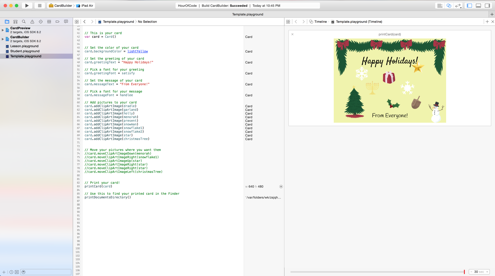

HolidayCard
===========

Build a Holiday Card for Hour of Code in Swift!

[Hour of Code](hourofcode.com) is a global initiative for introducing computer science to students at a young age.

This is a sample project that can be used to lead a Swift class to introduce basic programming concepts in under an hour. You will be writing code in Swift to design and build your own holiday card. Instructions for use are included inside the various playgrounds. Please take this example and go support the Hour of Code initiative!

The project includes a few parts:

- CardBuilder Framework
- Lesson Playground
- Student Playground
- Template Playground

## CardBuilder Framework

The CardBuilder Framework is a Swift framework that includes all of the code needed to actually produce a Holiday Card. It handles everything related to creating and modifying a UIView, and also provides handling methods for creating fonts, colors, and clip art images.

The whole point of the CardBuilder Framework is to abstract details of UIKit behind a wall so that students don't have to worry about it. They only have to worry about building the HolidayCard.

Because of the dependency on the framework, the lesson must be conducted inside of an Xcode workspace so that the playgrounds can reference the framework.

## Lesson Playground

The Lesson Playground is mostly empty. This is what you'll write code in from scratch to explain the concepts to the students. What you write here should mostly mirror what exists in the Template Playground.

## Student Playground

The Student Playground is what the students will use when it's their turn to write code. It has a few constants already defined, as well as the instantiated card and card preview.

## Template Playground

The Template Playground is a completed version of the Student Playground so that you can see what everything looks like.